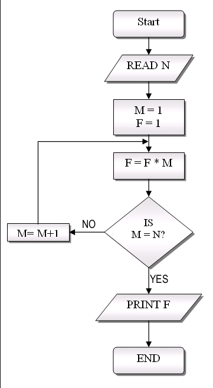

# Logical Operations

In programming, it is important to understand control flow. This is the flow in which our program will execute lines of code. Logical operations play a major
part in dictating that flow. Take a look at the image below.



The above depicts the start of a program, that will proceed to execute lines of code and then make decisions on how to proceed. We can envision this 
control flow diagram in code as such:


## Examples

### If Statements

=== "IfStatement"
    ```java
      /**
       *  In the below example our flow of execution will enter through the main() 
       *  function and traverse our code from "top to bottom". We use the IF 
       *  operator to manipulate the flow of execution, if the expression that
       *  follows an if statement resolves to "true" the nested code will be
       *  executed. If the expression is false, the nested code is NOT
       *  executed and instead is skipped over.
       *
       *  EXPECTED OUTPUT:
       *  ================
       *  Program Start
       *  This line was executed
       *  Program End
       */

      public static void main(String[] args) {
          System.out.println("Program Start");

          // The below expression will resolve to true, 
          // therfore its nested code will be executed
          if (1 == 1) {
              System.out.println("This line was executed");
          }

          // The below expression will resolve to false,
          // therefore its nested code will NOT be executed
          if (1 == 2) {
              System.out.println("This line was NOT executed");
          }

          System.out.println("Program End");
      }
    ```
=== "If Else Statement"
    ```java
        /**
         *  In the below example our flow of execution will enter through the main()
         *  function and traverse our code from "top to bottom". We use the IF and
         *  ELSE operators to manipulate the flow of execution, if the expression
         *  that follows an if statement resolves to "true" the nested code will be
         *  executed. Else another nested block of code will be executed.
         *
         *  EXPECTED OUTPUT:
         *  ================
         *  Program Start
         *  x was NOT equal to y
         *  Program End
         */

        public static void main(String[] args) {
            System.out.println("Program Start");

          int x = 1;
          int y = 2;

          if (x == y) {
              System.out.println("x was equal to y");
          } else {
              System.out.println("x was NOT equal to y");
          }

            System.out.println("Program End");
        }
    ```
=== "Multiple If Statements"
    ```java
    /**
     *  In the below example our flow of execution will enter through the main()
     *  function and traverse our code from "top to bottom". We use the IF and
     *  ELSE-IF and ELSE operators to manipulate the flow of execution, if the
     *  expression that follows an if statement resolves to "true" the nested
     *  code will be executed. Else IF the seconde IF condition resolves to true
     *  it's nested code will be executed, ELSE another nested block of code
     *  will be executed.
     *
     *  EXPECTED OUTPUT:
     *  ================
     *  Program Start
     *  x was equal to z
     *  Program End
     */

    public static void main(String[] args) {
        System.out.println("Program Start");

        int x = 1;
        int y = 2;
        int z = 1;

        if (x == y) {
            System.out.println("x was equal to y");
        } else if (x == z) {
            System.out.println("x was equal to z");
        } else {
            System.out.println("x was NOT equal to y OR z");
        }

        System.out.println("Program End");
    }
    ```