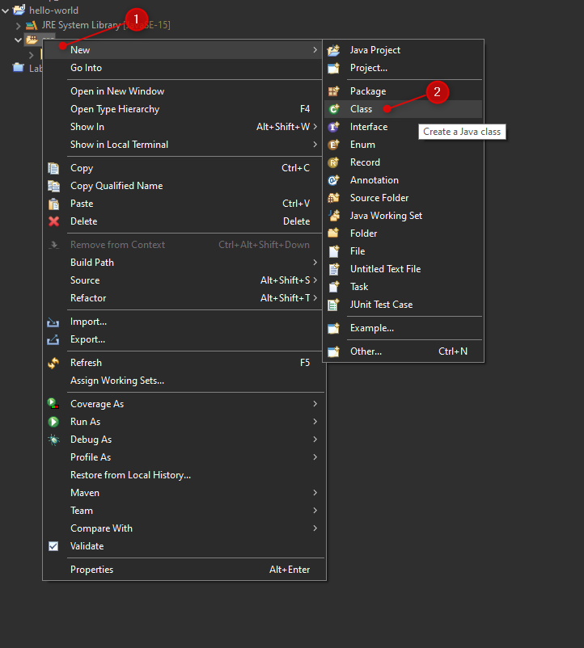

# Let's Program!

This section of my repo is to help you go from 0 to "hello-world" as quickly as possible. 

<b>This tutorial will be from a Windows user perspective.</b>

feel free to reach out with questions about setting up MAC OS, or Linux.

## Overview

1. Install Java
2. Install Eclipse
3. Hello, World!

### Install Java

- For the sake of this demo we will install java jdk 15. A jdk is a java development kit, think of it as all the tools you need to start programming in java!
- Visit: https://www.oracle.com/java/technologies/javase-jdk15-downloads.html 
- Select the correct download link based on your operating system. I will select the 64-bit exe for Windows
  
- Follow the instructions to complete the install
  

### Install Eclipse

TODO: Include Steps and screenshots

### Hello, World

- Let's Create a new java project in Eclipse
- First navigate to File -> New -> Project...

  
- Select Java Project

  
- Next Follow the instructions to setup our new project

  
- In our newly create src directory right click and create new class

  
- Lets give our class a name, and implement a `main` method

  
- Within our main method we will write to STDOUT by using the `System.out.println("Hello, World!")`

  